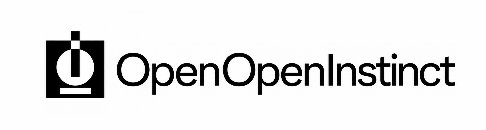
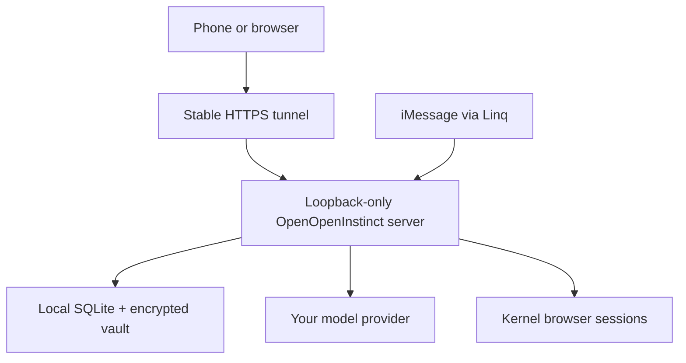

<div align="center">



**A self-hosted personal agent for iMessage and the web that can use a browser like you.**

OpenOpenInstinct runs as a long-lived process on your Linux computer, Mac, or
Windows 11 PC. Its application state and encrypted vault stay in a local SQLite
database. A stable HTTPS tunnel makes the service reachable from your phone.


</div>

> [!WARNING]
> OpenOpenInstinct can act through authenticated accounts and is still
> pre-production software. Use a dedicated OS account where practical, keep
> backups, review the threat model below, and require approval for consequential
> actions.

## What self-hosting means

The web application, authentication service, application database, migrations,
and encrypted vault run on a computer you control. There is no serverless
database or hosted application runtime to provision.



Some capabilities still call services you configure: Linq carries iMessage,
Kernel runs isolated remote browsers, and your selected model provider performs
inference. Those services receive the data required for their role. Vault
secrets are decrypted only by trusted server code and are filled directly into
approved browser fields; they are not returned to the model.

The Next.js listener deliberately binds to `127.0.0.1`, not `0.0.0.0`. The
tunnel runs on the same host and forwards to loopback. This avoids creating a
second unauthenticated LAN attack surface and makes mDNS or local-IP discovery
unnecessary.

## Requirements

- Linux, macOS, or Windows 11
- Node.js 24 and pnpm 11.24
- Git
- A Kernel API key
- A Linq API key, webhook secret, Linq phone number, and owner phone number
- One direct model-provider API key
- One of the stable tunnel options below

Clone and install:

```bash
git clone https://github.com/maceip/OpenOpenInstinct.git
cd OpenOpenInstinct
corepack enable
pnpm install --frozen-lockfile
```

On Windows, run the same commands in PowerShell. The launcher uses
`pnpm.cmd` and terminates its child process tree with `taskkill` when stopped.

## Configure the service

Copy the example environment file:

```bash
# Linux or macOS
cp .env.example .env.local
```

```powershell
# Windows PowerShell
Copy-Item .env.example .env.local
```

Generate the two values that define this installation. Generate them once,
store them in `.env.local`, and back them up:

```bash
node -e "console.log(require('node:crypto').randomBytes(24).toString('base64url'))"
node -e "console.log(require('node:crypto').randomBytes(32).toString('base64'))"
```

- Put the first value in `AUTH_INSTANCE_ID`.
- Put the second value in `VAULT_ENCRYPTION_KEY`.
- Set `PUBLIC_URL` to the exact stable HTTPS origin supplied by your tunnel,
  with no path, query, fragment, or trailing slash.
- Fill the Linq, Kernel, owner-phone, and selected model-provider variables.

For OpenAI, the minimal model configuration is:

```dotenv
AI_PROVIDER=openai
AI_MODEL=gpt-5-mini
OPENAI_API_KEY=...
```

Anthropic, Google, and OpenAI-compatible endpoints are also supported. See the
annotated options in `.env.example`.

Validate everything before startup:

```bash
pnpm self-host:check -- --tunnel=cloudflare
```

## Choose a stable tunnel

All three options have a no-paid-plan path. Account, domain, bandwidth, and
acceptable-use terms belong to the tunnel provider and can change. The security
model requires a reserved hostname; an ephemeral URL is not a deployment
option.

| Option | Stable public name | What to configure |
| --- | --- | --- |
| [Cloudflare Tunnel](https://developers.cloudflare.com/cloudflare-one/networks/connectors/cloudflare-tunnel/) | A hostname on a domain in Cloudflare | Create a **named** tunnel, route the hostname to `http://127.0.0.1:3000`, and set `CLOUDFLARED_TOKEN`. |
| [Tailscale Funnel](https://tailscale.com/docs/features/tailscale-funnel) | The machine's stable `*.ts.net` name | Sign in with the Tailscale CLI, enable Funnel, and set `TAILSCALE_FUNNEL_HOSTNAME` to the hostname used by `PUBLIC_URL`. |
| [zrok reserved share](https://docs.zrok.io/docs/concepts/sharing-reserved/) | A reserved public share | Enable the zrok CLI, reserve a public share for `http://127.0.0.1:3000`, and set `ZROK_RESERVED_SHARE` to its token. |

### Cloudflare named Tunnel

Install `cloudflared`, create the named tunnel and public hostname in
Cloudflare, then configure:

```dotenv
PUBLIC_URL=https://assistant.example.com
TUNNEL_PROVIDER=cloudflare
CLOUDFLARED_TOKEN=...
```

```bash
pnpm self-host -- --tunnel=cloudflare
```

Do not use a Quick Tunnel or a `*.trycloudflare.com` URL. Those hostnames are
temporary, and the launcher rejects them.

### Tailscale Funnel

Install and sign in to Tailscale, enable HTTPS and Funnel for the machine, then
configure its stable MagicDNS name:

```dotenv
PUBLIC_URL=https://your-machine.your-tailnet.ts.net
TUNNEL_PROVIDER=tailscale
TAILSCALE_FUNNEL_HOSTNAME=your-machine.your-tailnet.ts.net
```

```bash
pnpm self-host -- --tunnel=tailscale
```

The launcher runs `tailscale funnel --yes 3000` and verifies that the configured
`.ts.net` hostname matches `PUBLIC_URL`.

### zrok reserved share

Install and enable zrok, reserve a public share that targets
`http://127.0.0.1:3000`, then configure the reserved token and its public URL:

```dotenv
PUBLIC_URL=https://your-reserved-share.example
TUNNEL_PROVIDER=zrok
ZROK_RESERVED_SHARE=...
```

```bash
pnpm self-host -- --tunnel=zrok
```

Use a **reserved** share. A transient share has the same continuity problem as
any other temporary tunnel URL.

You can override a tunnel executable path with `CLOUDFLARED_COMMAND`,
`TAILSCALE_COMMAND`, or `ZROK_COMMAND`.

## Startup and process lifecycle

`pnpm self-host` validates configuration, migrates SQLite, builds the Eve and
Next.js applications, starts Next.js on `127.0.0.1:3000`, starts the tunnel,
waits for the public health endpoint, and synchronizes device recovery.

`SIGINT` and `SIGTERM` shut down the server and tunnel process tree. Browser
sessions run in Kernel rather than as local Chromium processes, so a stopped
host does not leave local browser processes behind. Interrupted browser tasks
are marked accordingly when the UI resumes.

For unattended startup, run the same launcher from systemd on Linux, launchd on
macOS, or Task Scheduler on Windows. Set its working directory to the repository
root. Prefer an absolute `DATABASE_PATH` so a process manager cannot change the
database location.

## Device authentication

OpenOpenInstinct does not use passkeys tied to the tunnel hostname and does not
use short pairing codes. Each browser creates a non-extractable P-256 signing
key. The server stores only its public key. Session recovery uses a two-minute,
one-use challenge whose signed payload is bound to the installation ID, device,
key epoch, exact public origin, and expiry.

Initial enrollment uses a 256-bit one-use secret in a URL fragment:

```text
https://assistant.example.com/sign-in#v1.<instance>.<pairing>.<secret>
```

Fragments are not sent in HTTP requests. The sign-in page removes the fragment
from browser history before redemption. The server stores only a hash of the
pairing secret, consumes it transactionally, and defaults to a 10-minute expiry.
Session secrets are also 256-bit values stored only as hashes; HTTPS sessions
use `Secure`, `HttpOnly`, `SameSite=Strict`, `__Host-` cookies.

Create an additional device link manually, or list and revoke devices:

```bash
pnpm auth:pair -- --send=linq --continue=messages
pnpm auth:devices
pnpm auth:revoke -- --id=<device-id>
```

Revocation also invalidates the device's active sessions.

## Automatic tunnel-origin recovery

A stable hostname is the normal solution. If the hostname nevertheless changes,
the old browser origin cannot read the new origin's cookies or IndexedDB, and a
WebAuthn credential bound to the old RP ID cannot simply be moved. Recovery is
therefore explicit, authenticated, and out of band:


The local SQLite `instance_state` table records the last healthy public origin.
After every startup, the launcher waits until the configured public endpoint is
reachable. On first setup or a changed origin it automatically:

1. Creates a new 256-bit, short-lived, one-use pairing.
2. Sends the full link to `OWNER_PHONE_NUMBER` through Linq.
3. Records the new origin only after delivery succeeds.
4. Invalidates unconsumed pairings for the old origin.

The user does not copy or paste a hostname. Tapping the link creates the new
origin's device key and session, clears the secret fragment, then attempts to
open the iMessage conversation via `LINQ_PHONE_NUMBER`. If the mobile OS blocks
an automatic handoff, the completed page shows **Open Messages** and **Continue
to OpenOpenInstinct** buttons, so the user is never stranded on a blank page.

`PUBLIC_URL` is authoritative. Authentication URLs are never derived from an
untrusted `Host` or forwarding header.

## SQLite data and backups

The default database is `.data/openopeninstinct.sqlite`. Relative paths are
resolved to an absolute path at process startup; daemon installations should set
an explicit absolute path.

Every connection enables:

```sql
PRAGMA journal_mode = WAL;
PRAGMA busy_timeout = 5000;
PRAGMA synchronous = FULL;
PRAGMA foreign_keys = ON;
PRAGMA trusted_schema = OFF;
PRAGMA secure_delete = ON;
```

WAL allows low-volume chat, vault, authentication, and browser-session work to
overlap without a separate database server. Versioned SQLite migrations run
before the service accepts traffic.

For a consistent backup, stop the launcher and copy both the SQLite file and
your environment file. Back up `VAULT_ENCRYPTION_KEY` separately: losing it
makes encrypted vault values unrecoverable. Never replace the key without a
planned re-encryption migration.

On POSIX systems the launcher applies a restrictive umask and mode `0600` to
the database, WAL/SHM sidecars, and local environment files. On Windows, keep
the checkout inside the intended user's private profile and restrict its NTFS
ACL. File permissions do not protect against a malicious process already
running as the same OS user.

See [`db/README.md`](db/README.md) for the schema and migration contract.

## Security model

- **DNS rebinding and CSRF:** all routed requests must use the exact configured
  host. Unsafe methods also require the exact configured `Origin`. Forwarded
  host headers are not trusted.
- **Owner isolation:** database scopes come from a validated device session or
  verified owner Linq channel, never from `x-user-id`, `x-session-id`, or
  another client-selected identity header.
- **Vault encryption:** values use AES-256-GCM with a random 96-bit nonce and
  authenticated workspace, namespace, and item identity. Missing vault fields
  return structured errors instead of empty strings.
- **Authentication abuse:** global and per-device attempt limits complement
  high-entropy, short-lived, one-use pairings and challenges.
- **Streaming continuity:** the Eve NDJSON stream disables proxy buffering. The
  client detects idle or dropped streams, retries with backoff, and can resume a
  durable session after sleep, wake, visibility, or network changes.
- **Route continuity:** `/chat` is canonical. Legacy `/s/...` links redirect
  to the equivalent route instead of mounting a second chat client.
- **Server/client boundary:** Next-only modules use the `server-only` sentinel,
  and CI checks prevent server imports from client components.

The main remaining local trust boundary is the host OS account. A same-user
malicious process can read the database, environment, or browser profile. Keep
the machine patched, use full-disk encryption, avoid untrusted software under
the service account, and revoke a lost device promptly.

## Development and verification

Development uses the same SQLite, direct model provider, vault, and device-auth
code paths:

```bash
pnpm db:migrate
pnpm dev
```

Before contributing:

```bash
pnpm check
pnpm build
```

GitHub Actions runs migrations and checks on current Ubuntu, macOS, and Windows
runners, followed by a production build.

---

<div align="center">

Built with [Eve](https://eve.dev) · [Kernel](https://kernel.sh) · [Linq](https://linq.app) · SQLite

</div>
